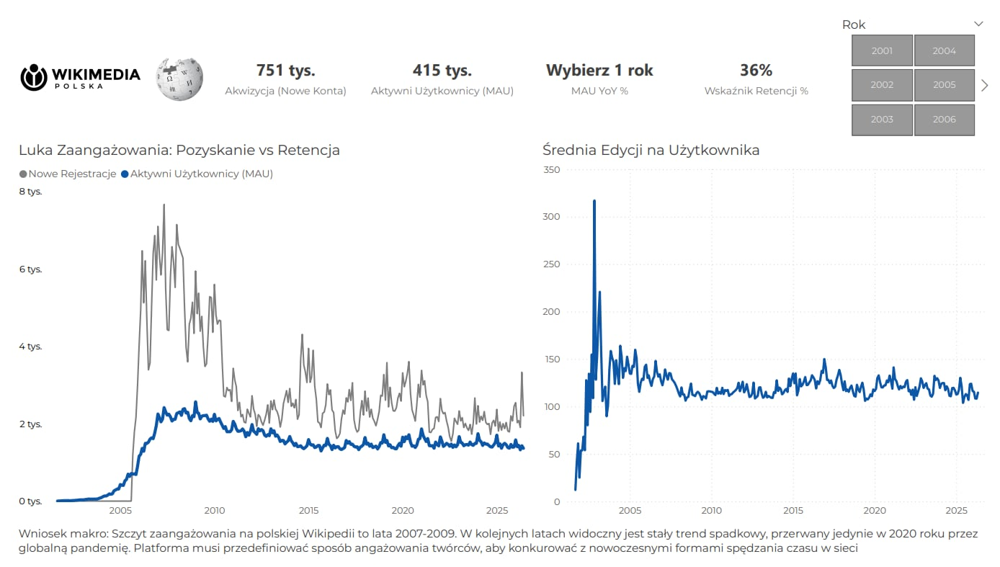

# Wikipedia as a Product | Analiza Akwizycji i Retencji Twórców

Cześć! To mój projekt analityczny przygotowany w ramach wyzwania #BI_NGO. Zamiast analizować Wikipedię jako zwykłą bazę wiedzy, potraktowałem ją jak klasyczny produkt cyfrowy (SaaS). 

Sprawdziłem, jak na przestrzeni kilkunastu lat wyglądało pozyskiwanie nowych twórców, ilu z nich faktycznie edytowało artykuły (MAU) i jak radzono sobie z ich utrzymaniem.

## Wykorzystane technologie
* **Wizualizacja:** Microsoft Power BI
* **Przygotowanie danych (ETL):** Python (Pandas)
* **Logika i zapytania:** DAX, SQL

## Architektura danych i DAX
Zależało mi na wydajności i odporności raportu na błędy (tzw. defensive programming):
* **Model Gwiazdy (Star Schema):** Rozdzieliłem tabele faktów od wymiarów i zbudowałem dedykowaną tabelę Kalendarza. Dzięki temu filtrowanie po datach działa płynnie.
* **Czysty interfejs w DAX:** Zabezpieczyłem raport przed wyświetlaniem technicznych błędów. Miara `MAU YoY %` wykorzystuje funkcję `HASONEVALUE` – jeśli użytkownik nie wybierze roku, raport po prostu prosi o jego wskazanie, zamiast rzucać błędem `NaN`. Podobnie obsłużyłem puste miesiące używając wartości `BLANK()`, by wykresy liniowe urywały się naturalnie na ostatnim aktywnym okresie, zamiast sztucznie pikować do zera na końcu osi czasu.

## UI/UX i praca z Brand Bookiem
Raport jest w 100% zgodny z oficjalnym Brand Bookiem Wikimedii. Zrezygnowałem z domyślnych motywów Power BI:
* **Kolorystyka:** Użyłem sztywnych kodów HEX (Niebieski: `#0C57A8`, Szary: `#7F7F7F`, Tekst: `#404040`).
* **Typografia (Custom JSON):** Power BI domyślnie nie wspiera oficjalnego fontu fundacji (Montserrat). Żeby to obejść, napisałem własny motyw `.json`, który wymusił tę czcionkę na wszystkich nagłówkach i wskaźnikach KPI.
* **Układ:** Postawiłem na klasyczny F-Pattern. Najważniejsze liczby i logotypy rzucają się w oczy od razu na górze, a szczegółowe trendy są zagregowane poniżej.

## Co wynika z danych?
* **Historyczny szczyt:** Największy ruch i zaangażowanie edytorów na polskiej Wikipedii to lata 2007-2009. Od tego momentu widać długi, stały trend spadkowy.
* **Anomalia 2020:** Ten spadek przerwał w zasadzie tylko rok 2020 (globalna pandemia). Wskaźnik MAU podskoczył wtedy o 6,27%, a średnia edycji na użytkownika mocno wystrzeliła w górę.
* **Wniosek biznesowy:** Dane z 2020 roku udowadniają, że ludzie chcą edytować Wikipedię, gdy mają na to czas i znikają inne rozpraszacze. Żeby dzisiaj skutecznie walczyć o czas twórców z algorytmami social mediów, platforma prawdopodobnie potrzebuje nowych mechanizmów angażowania (np. grywalizacji), bo stary model oparty wyłącznie na pasji powoli się wyczerpuje.
