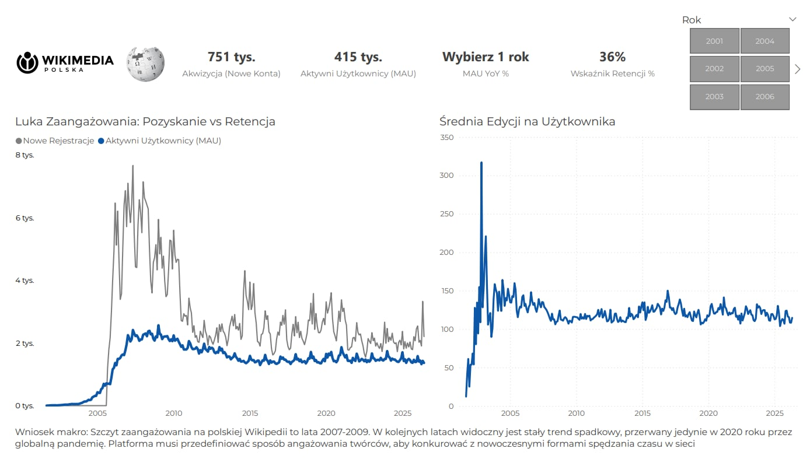

*[🇵🇱 Przeczytaj dokumentację w języku polskim](README_pl.md)*

# Wikipedia as a Digital Product | Creator Acquisition & Retention Analytics

## Project Overview
This analytics project was developed for the **#BI_NGO** challenge. Instead of treating Wikipedia merely as a knowledge repository, this analysis evaluates the platform as a classic SaaS (Software as a Service) digital product. 

The dashboard tracks the long-term lifecycle of Polish Wikipedia creators, focusing on user acquisition (New Registrations), active engagement (Monthly Active Users - MAU), and platform retention strategies.

## Dashboard Preview

  

## Technical Architecture & Workflow

### 1. Data Engineering & ETL (Python / Pandas)
* **API Data Cleansing:** Raw data extracted from the Wikimedia API contained malformed date timestamps. I developed a Python script utilizing **Regular Expressions (RegEx)** to sanitize and rebuild standard `YYYY-MM-DD` timestamps, preventing downstream ingestion errors in Power BI.
* **Traffic Isolation:** Filtered out automated machine/bot operations to isolate strictly human engagement metrics, ensuring the accuracy of user retention KPIs.
* **Fact Table Aggregation:** Merged multiple cleaned data frames into a single, optimized `wikipedia_product_metrics.csv` Fact Table ready for dimensional modeling.

### 2. Data Modeling & DAX (Defensive Programming)
* **Star Schema Architecture:** Separated the aggregated Fact Table from dimensions, implementing a dedicated internal Calendar table to ensure robust time-intelligence filtering.
* **Error-Proof DAX Measures:** Applied defensive programming principles to DAX calculations. For example, the `MAU YoY %` measure utilizes `HASONEVALUE` to prompt users to select a specific year instead of rendering `NaN` errors. Handled empty operational periods using `BLANK()` to ensure line charts break naturally rather than plummeting artificially to zero.

### 3. UI/UX & Brand Book Compliance
* **Custom JSON Theming:** Since Power BI natively restricts font uploads, I developed and imported a custom `.json` theme file to forcefully implement **Montserrat** (the official Wikimedia Foundation font) across all KPIs and headers.
* **Strict Color Palette:** Fully compliant with the Wikimedia Brand Book using exact HEX codes (Blue: `#0C57A8`, Light Gray: `#7F7F7F`, Dark Gray: `#404040`).
* **Visual Hierarchy:** Applied an F-Pattern layout. High-level SaaS metrics are immediately visible at the top, cascading down to detailed historical trends.

---

## Key Business Findings & Recommendations

* **The Historical Peak:** The highest creator engagement on Polish Wikipedia occurred between 2007–2009, followed by a prolonged, steady downward trend.
* **The 2020 Anomaly:** The only significant disruption to this decline was the year 2020 (global lockdown). The MAU index spiked by **6.27%**, and the average edits per user surged significantly.
* **Strategic Takeaway:** The 2020 data proves that users are willing to engage and edit when they have the time and lack external distractions. To successfully compete with modern social media algorithms for creators' attention, the platform must evolve beyond its legacy "passion-based" model and introduce modern engagement mechanics (e.g., UI gamification).
